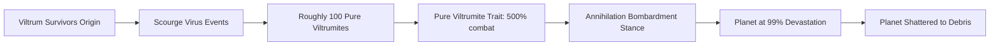

<p align="center"></p>

<h1 align="center">Viltrum Empire</h1>

<p align="center">A total-conversion Stellaris mod that drops the factions of the <em>Invincible</em> universe — the planet-shattering Viltrumites and the powers that resist them — into Paradox's grand-strategy galaxy.</p>

<p align="center">
  <a href="https://steamcommunity.com/sharedfiles/filedetails/?id=3602982845"></a>
  
  
</p>

- **Play the Invincible universe** — seven canon factions (Viltrumites, GDA, Thraxxans, Coalition, Sequids, Flaxans, Martians) ship as playable species and ready-made empires.
- **Asymmetric, lore-accurate balance** — the Pure Viltrumite trait grants 500% army damage and near-immortal leaders, offset by near-zero (-95%) population growth, so you conquer instead of grow.
- **Event-driven signature mechanics** — a Scourge Virus event chain culls the Viltrumite race to roughly 100 survivors at game start, and a custom bombardment stance shatters worlds to debris at maximum devastation.

## Install

**Steam Workshop (recommended)** — [Subscribe on the Workshop](https://steamcommunity.com/sharedfiles/filedetails/?id=3602982845), then enable **Viltrum Empire** in the Stellaris launcher's mod list.

**Manual** — place this mod folder inside your Stellaris `mod` directory so the launcher reads its `descriptor.mod`, then enable it in the launcher:

| OS | Mod directory |
|---|---|
| Windows | `%USERPROFILE%\Documents\Paradox Interactive\Stellaris\mod\` |
| macOS | `~/Documents/Paradox Interactive/Stellaris/mod/` |
| Linux | `~/.local/share/Paradox Interactive/Stellaris/mod/` |

## Species and factions

Seven playable species, each mapped to its *Invincible* counterpart with its own trait set and name list. The **Viltrumites** are the dominant warrior race — superhuman strength, a 5,000-year lifespan, and combat stats that mirror their canonical invincibility. The **GDA (Humans)** play as Earth's defensive establishment, leaning on engineering research and hull regeneration for a fortify-and-hold game. **Thraxxans**, **Coalition**, **Sequids**, **Flaxans**, and **Martians** each fill a distinct strategic niche.

## Prescripted empires

Seven ready-to-play empires ship in `prescripted_countries/`: `viltrum_empire`, `gda_empire`, `thraxxan_empire`, `coalition_planets`, `sequid_consciousness`, `flaxan_empire`, and `martian_empire`. Each pairs a species with its authority, ethics, civics, custom origin, and ruler — for example the Viltrum Empire is a dictatorial xenophobe-militarist state under Grand Regent Thragg, built on the **Viltrum Survivors** origin. The Viltrum Empire ships a custom flag; the other empires draw on Stellaris' built-in flags and portraits.

## Traits and balancing

Balance is derived from canon rather than min-maxing — one bespoke species trait file per faction, plus a shared leader-trait set. The **Pure Viltrumite** trait is deliberately extreme: +5,000 leader lifespan, 500% army damage and health, +30% research speed, and perfect habitability, all offset by -95% population growth. **GDA Training** instead rewards defense (engineering research, hull regeneration, extra defense platforms). No two species play alike.

## Events and narrative

Two event chains drive the mod's signature moments, wired through custom `on_actions`:



The **Scourge Virus** chain (`viltrum_start_pops`) fires at game start for Viltrum Survivors empires, culling the population from billions to a hundred elite survivors. The **annihilation** chain (`viltrum_annihilation`) pairs with a custom bombardment stance that shatters any planet reaching 99% devastation into uninhabitable debris. Six custom event pictures back the narrative pop-ups.

## Localisation and presentation

All player-facing text lives in a single English localisation file with Stellaris-native color-coded tooltips, written as flavor-forward prose rather than dry stat lists. A custom Viltrumite species class and portrait set, a bespoke Viltrum flag (with a map-mode variant), and the event-picture interface definitions round out the presentation.

## Compatibility

Built for and supporting **Stellaris v4.1.7** (per `descriptor.mod`). As a total conversion it reworks core content and is not intended to run alongside other major overhaul mods.

## Mod structure

```
descriptor.mod              Mod metadata (name, version, Workshop id, tags)
thumbnail.png               Workshop thumbnail
common/
  species/                  7 species definitions
  traits/                   7 species trait files + shared leader traits
  governments/civics/       7 faction origin/civic files (incl. Viltrum Survivors)
  name_lists/               7 per-species name lists
  species_classes/          Custom VILTRUMITE species class
  portrait_sets/            Viltrumite portrait mapping
  on_actions/               Event triggers
  bombardment_stances/      Viltrumite annihilation stance
events/                     Scourge Virus + planet annihilation event chains
prescripted_countries/      7 playable prescripted empires
flags/viltrum/              Custom Viltrum flag (+ map-mode variant)
gfx/event_pictures/         Event picture textures
interface/                  Event picture sprite definitions
localisation/english/       English strings and tooltips
```

## License

Proprietary — Copyright (c) 2026 Trenton Taylor. All rights reserved. No permission is granted to use, copy, modify, or distribute the software. See [LICENSE.md](LICENSE.md).
